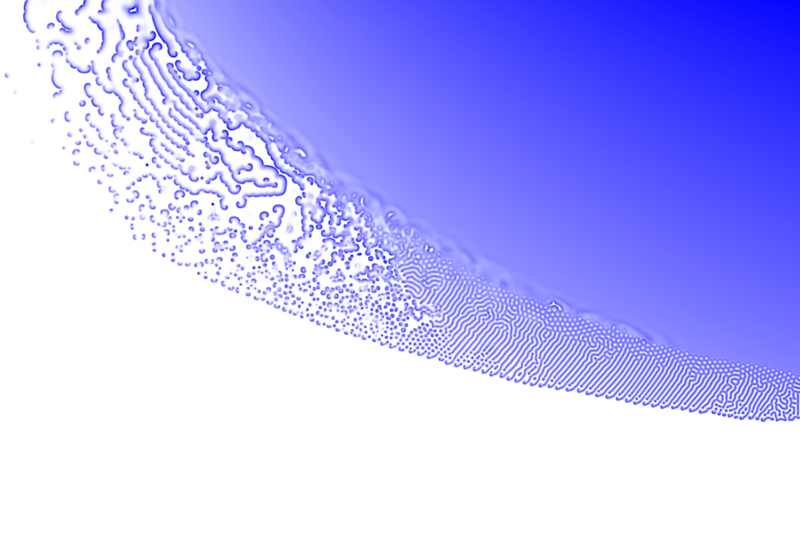

# Simulation of the Gray-Scott Equations with Spatial Heterogeneity in Julia

The [Gray-Scott](http://mrob.com/pub/comp/xmorphia/) system comprises of two
coupled partial differential equations. Small changes in its parameters can
lead to a wide variety of spatial patterns.

To show the variety of behaviour shown by the system, it is natural to vary the
parameters through space within a single simulation, as done in this repository.

## Simulation output

Parameters are as in `gray_scott.jl`, which implements a finite-difference
method. The final state is shown below. The transient response in shown in
`gray_scott.mp4`.

